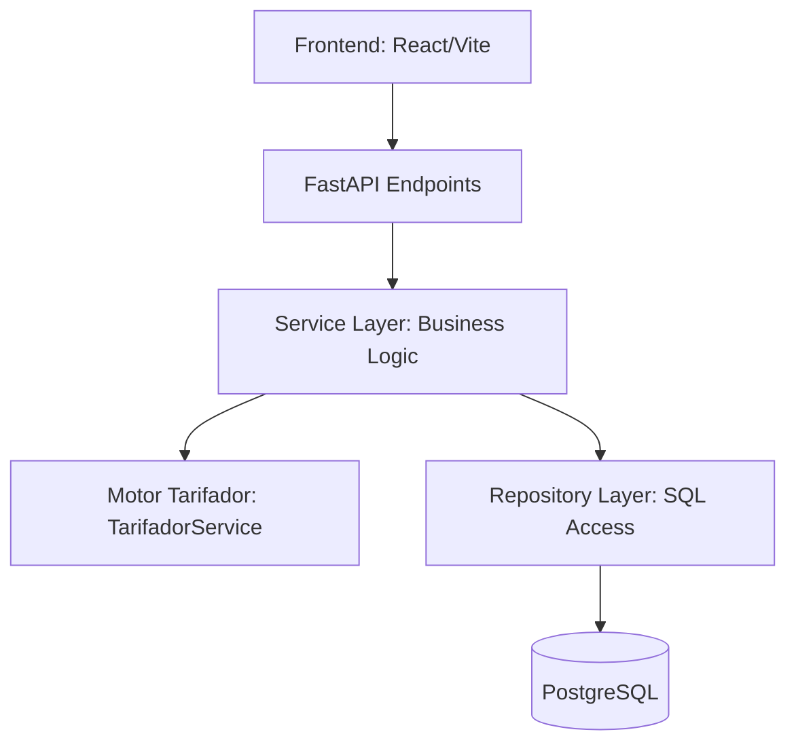

# Arquitectura del Sistema - ParkingController

Este documento describe la arquitectura lógica y física del sistema ParkingController, diseñado bajo principios de **Clean Architecture** y **Separación de Responsabilidades**.

## Diagrama Lógico

La aplicación se divide en capas bien definidas que garantizan que la lógica de negocio permanezca independiente de la infraestructura (BD, API).

### Capas del Backend

1.  **API Layer (`app/api/`)**: Define los contratos REST. Valida los datos de entrada usando Pydantic. No contiene lógica de negocio, solo orquestación de llamadas a servicios.
2.  **Service Layer (`app/services/`)**: Contiene la lógica central. Aquí reside el `ParkingService`, que coordina el ciclo de vida del ticket, y el `Tarifador`, que se especializa en cálculos matemáticos.
3.  **Repository Layer (`app/repositories/`)**: Encapsula el acceso a datos usando SQLAlchemy. Implementa un `BaseRepository` genérico para operaciones CRUD estándar.
4.  **Model/Domain Layer (`app/models/`)**: Define las entidades de la base de datos y las reglas estructurales de los datos.

## Desacoplamiento del Motor Tarifario

Una de las decisiones arquitectónicas más críticas fue la extracción de las fórmulas de cálculo a un servicio independiente llamado `Tarifador`.

- **Independencia**: El `ParkingService` no sabe "cómo" se calcula un monto, solo sabe que debe pedirle al `Tarifador` que lo haga basado en una tarifa.
- **Extensibilidad**: Agregar nuevos modos de cobro (ej: Fraccionado por 15 min, Tramos horarios) solo requiere modificar el `Tarifador` sin tocar el resto del sistema de ventas.

## Flujo de Datos (Data Flow)

1.  **Request**: El cliente envía una petición con un código de ticket.
2.  **Validation**: El endpoint valida el formato del código.
3.  **Simulation**: El servicio recupera el ticket y la tarifa activa, delega al tarifador el cálculo dinámico y devuelve una "Simulación" (estado transitorio).
4.  **Persistence**: Al momento del cobro, el servicio congela ese valor en una tabla de `liquidaciones`, vinculándola al ticket y cambiando su estado.
5.  **Audit**: Todas las operaciones de cambio de estado quedan registradas para auditoría posterior.
