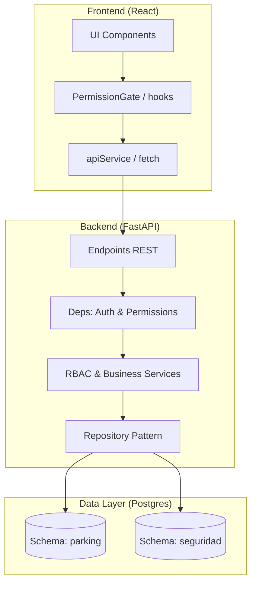

# Arquitectura del Sistema - ParkingController

Este documento describe la arquitectura lógica y física del sistema ParkingController, diseñado bajo principios de **Clean Architecture**, **Separación de Responsabilidades** y **Seguridad Centrada en el Backend**.

## Diagrama Lógico de Capas

El sistema implementa una arquitectura desacoplada donde el Frontend es un consumidor ligero de una API robusta que controla el estado y la seguridad.

## Estrategia de Seguridad (RBAC Dinámico)

Una de las decisiones arquitectónicas fundamentales en la fase actual es el **RBAC Dinámico**:

1.  **Backend como Fuente de Verdad**: La lógica de permisos no reside en constantes del frontend. El backend es quien inyecta la lista de permisos en el token/perfil al autenticar.
2.  **Middlewares de Autorización**: Se utilizan dependencias de FastAPI para interceptar cada petición y validar permisos contra la base de datos antes de ejecutar la lógica de negocio.
3.  **Aislamiento de Esquemas**: La seguridad reside en un esquema PostgreSQL separado (`seguridad`), protegiendo las tablas críticas de acceso accidental o inyecciones que afecten la operación comercial.

## Componentes Clave del Backend

1.  **API Layer (`app/api/`)**: Gestión de contratos Pydantic y enrutamiento.
2.  **Service Layer (`app/services/`)**: Orquestación de lógica. Incluye el `TarifadorService` (cálculos financieros) y el `RBACService` (gestión de acceso).
3.  **Repository Layer (`app/repositories/`)**: Implementa el patrón Repositorio para independizar la lógica de la persistencia de datos.

## Desacoplamiento del Motor Tarifario

El cálculo de montos está extraído a un servicio independiente. Esto permite:
- **Flexibilidad**: Cambiar reglas de cobro sin afectar el ciclo de vida del ticket.
- **Auditabilidad**: Los cálculos pueden ser simulados y verificados internamente antes de ser liquidados en el ticket.

## Flujo de Datos para Operaciones Protegidas

1.  El usuario intenta realizar una acción (ej: Editar Tarifa).
2.  El Frontend verifica localmente el permiso en `user.permissions` para mostrar/ocultar el botón.
3.  Si el usuario logra enviar la petición, el Backend intercepta el JWT, carga el rol del usuario y valida en la tabla `roles_permisos` si la acción es lícita.
4.  Solo si ambas validaciones pasan, se ejecuta la operación y se registra en los logs de auditoría.
